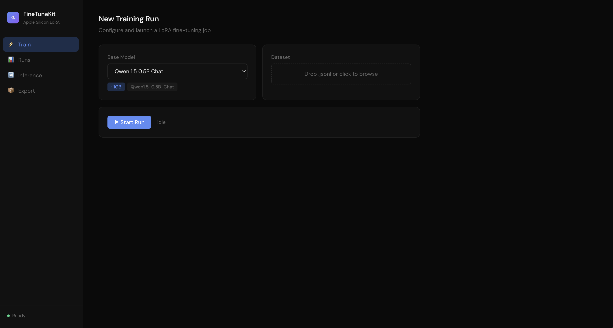
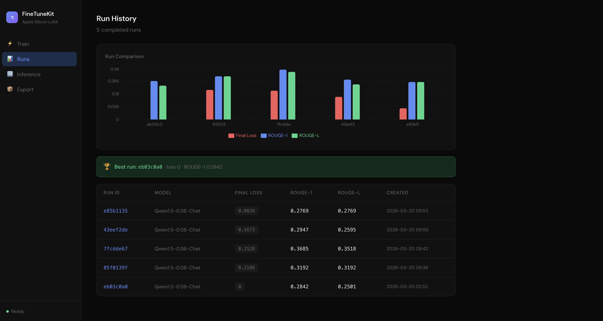
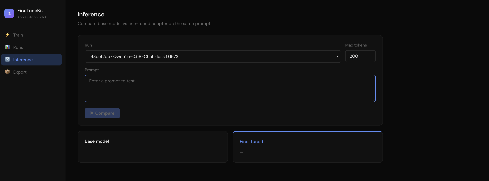
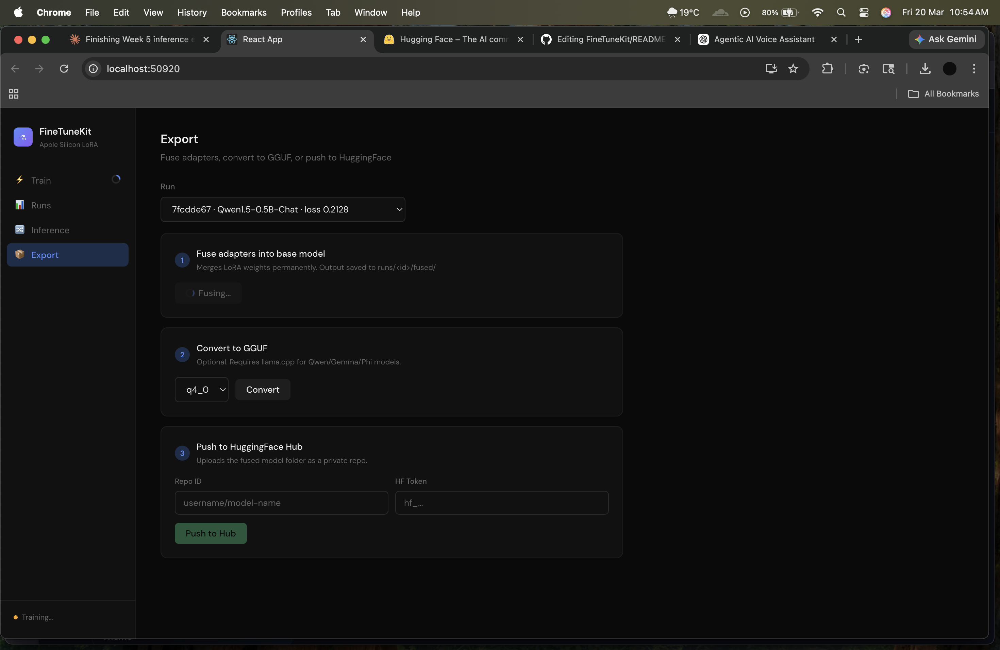

# FineTuneKit 🍎

An open-source local fine-tuning pipeline for LLMs, built for Apple Silicon using MLX. Train, evaluate, and export LoRA-adapted models — entirely on-device, no cloud required.

## Screenshots

### Train


### Runs & Comparison


### Inference


### Export


## Features

- ✅ MLX LoRA training on Apple Silicon (Metal GPU)
- ✅ Config-driven via `config.yaml` + Pydantic validation
- ✅ JSONL dataset ingestion with validation & stats
- ✅ Instruct / Chat / Completion prompt templates
- ✅ ROUGE + loss evaluation
- ✅ Run registry — tracks every experiment with metrics
- ✅ CLI: `ftk run`, `ftk runs`, `ftk validate-data`, `ftk init`
- ✅ FastAPI backend with WebSocket streaming
- ✅ React UI — live loss chart, run comparison bar charts
- ✅ Side-by-side inference: base model vs fine-tuned adapter
- ✅ Export: fuse adapters, convert to GGUF, push to HuggingFace Hub

## Quickstart
```bash
git clone https://github.com/TDevViper/FineTuneKit.git
cd FineTuneKit
python -m venv .venv && source .venv/bin/activate
pip install -r requirements.txt
```

**Start the API:**
```bash
uvicorn api.server:app --port 8000
```

**Start the UI (in a second terminal):**
```bash
cd ui && npm install && npm run build && npx serve -s build
```

Open `http://localhost:3000`

## Project Structure
```
finetunekit/
├── api/              # FastAPI server + WebSocket streaming
├── cli/              # CLI entrypoint (ftk commands)
├── pipeline/         # Ingestor, preprocessor, trainer, evaluator, exporter
├── registry/         # Run registry
├── ui/               # React frontend
├── configs/          # YAML config files
└── data/             # Your training data (.jsonl)
```

## Config
```yaml
model:
  name: "mlx-community/Qwen1.5-0.5B-Chat"
  max_tokens: 512
dataset:
  path: "data/train.jsonl"
  format: "instruct"   # instruct | chat | completion
  train_split: 0.8
training:
  epochs: 3
  batch_size: 2
  learning_rate: 2e-5
  lora_rank: 2
  lora_alpha: 2
  lora_dropout: 0.0
  save_every: 10
  output_dir: "runs/"
```

## Dataset Format
```jsonl
{"instruction": "What is gravity?", "output": "Gravity is a force that pulls objects toward each other."}
```

## Supported Models

| Model | VRAM |
|-------|------|
| Qwen 1.5 0.5B Chat | ~1GB |
| Qwen 1.5 1.8B Chat | ~2GB |
| Qwen2 0.5B Instruct 4bit | ~0.5GB |
| Mistral 7B Instruct 4bit | ~4GB |
| Llama 3.1 8B Instruct 4bit | ~5GB |
| Gemma 2 2B Instruct 4bit | ~2GB |

## Requirements

- Apple Silicon Mac (M1/M2/M3/M4)
- Python 3.10+
- Node.js 18+

---
Built with ❤️ on Apple Silicon
